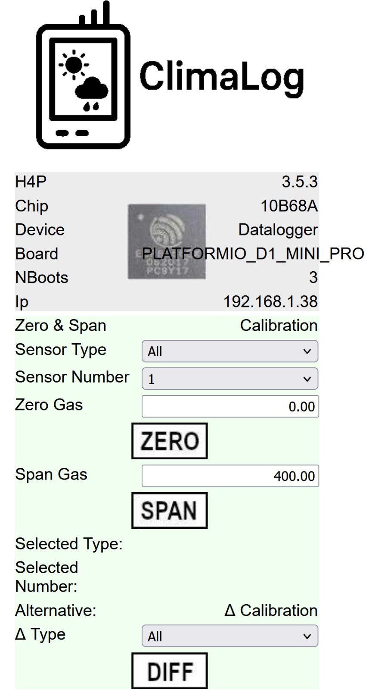

# Asynchronous datalogger using ESP8266

**_WARNING:_** This code is not yet finalised: Calibration routines have not yet been implemented.

Asynchronous datalogger using ESP8266 for logging scientific sensors to MicroSD

Preliminary calibration web interface:

  

## Prerequisites
- Requires a GPS module for date, time and location

The following sensors/components are implemented currently:
- [Texas Instruments ADS1115](https://www.ti.com/product/ADS1115) analogue multiplexer
- [Texas Instruments TCA9548](https://www.ti.com/product/TCA9548A) i2c multiplexer
- MicroSD card data storage with circular storage buffer
- Analogue battery charge reading (voltage)
- Environmental physics equations
- [Sierra Wireless XA1110](https://source.sierrawireless.com/devices/positioning-modules/xa1110/) GPS module
- [Sensirion SCD-30](https://sensirion.com/products/catalog/SCD30) CO2 sensor
- [DFRobot SEN0465](https://www.dfrobot.com/product-2510.html) O2 sensor
- [Bosch BME280](https://www.bosch-sensortec.com/products/environmental-sensors/humidity-sensors-bme280/) air temperature, relative humidity & pressure sensor
- [Melexis MLX90614](https://www.melexis.com/en/product/MLX90614/Digital-Plug-Play-Infrared-Thermometer-TO-Can) thermal radiation sensor
- WIFI & web interface

To be done:
- Implement calibration routines & their control through the web interface

## How to Cite

This citation does not work yet. Simply cite the github repository as a website for now:
Muller (2025). *datalogger_esp8266: Asynchronous datalogger using ESP8266*

## License

This software is distributed under the GNU GPL version 3. Any modification of the code in this repository may only be released under the same license, and with attribution of authorship of the original code (i.e., citation above).