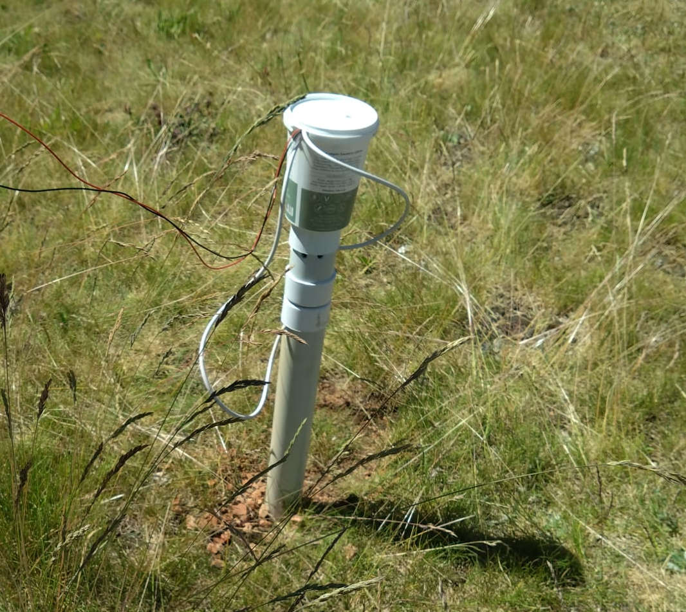

[](https://doi.org/10.5281/zenodo.20527520)

[](https://www.gnu.org/licenses/gpl-3.0)

# Asynchronous datalogger using ESP8266

Asynchronous datalogger using ESP8266 for logging scientific sensors to MicroSD

## Offline dashboard

The firmware starts a protected setup access point when it has no saved Wi-Fi
credentials and, after a 30-second station outage, exposes the dashboard again
through that access point. Change `HOTSPOT_PASSWORD`, `DASHBOARD_USER` and
`DASHBOARD_PASSWORD` in `src/main.cpp` before deployment.

Open `http://192.168.4.1/` on the access point, or the logger's address on your
network. The dashboard has four tabs:

- **Status** — whether the logger is actually recording, GPS fix and time
  quality, battery, free heap, MicroSD space and write errors, per-bus I2C
  health and the supervisor counters. Updates once a second.
- **Calibration** — sessions, live raw versus calibrated readings, zero/span
  and differential calibration, and the stored coefficients.
- **WiFi** — scan for networks and join one.
- **Console** — runs the same commands as the serial port, for when something
  needs poking at and no cable is to hand.

It is a small single-page app served from the logger's own flash: no internet
connection is needed and nothing is loaded from a CDN. It scales from a phone
in the field to a desktop browser, and follows your system's light or dark
theme (with a toggle to override).

> The web interface lives in `web/src/`. A pre-build script minifies and gzips
> it into `data/h4/`, so after changing it you must upload the filesystem as
> well as the firmware:
>
> ```bash
> pio run -e d1_mini_pro -t upload -t uploadfs
> ```

GPS is connected directly to the I2C bus. Its reader is deliberately separate
from the TCA9548A channels; do not pass the multiplexer to the GPS constructor
unless the hardware wiring changes.

Sensor & logger testing in the field

<p align="center">
  
</p>


## Serial commands

The web interface has no private channel to the firmware: every button on it
runs one of the commands below, over `GET /rest/<command>/<parameters>`. So
anything the dashboard can do can also be done from the serial port or with
`curl`, which is what you want when no Wi-Fi is available, when calibrating
from a script, or when a logger needs rescuing.

### Connecting

Connect at **115200 baud** (`monitor_speed` in `platformio.ini`; the firmware
takes the same value through `PROJ_BAUD_RATE`):

```bash
pio device monitor -e d1_mini_pro
```

Type a command and press Enter. Parameters are separated by a forward slash,
with no spaces:

```
command/parameter/parameter/...
```

Commands are case-sensitive. `help` lists every command the firmware knows,
including the built-in H4 ones described at the end of this section.

### Overview

| Command | Parameters | Needs a session | What it does |
| --- | --- | --- | --- |
| `cal_start` | none | – | Starts a calibration session |
| `cal_stop` | none | yes | Saves everything measured in the session |
| `cal_discard` | none | yes | Throws the session away without saving |
| `cal` | 3–4 | yes | Measures the sensor and calibrates from the reading |
| `set` | 5 | yes | Stores a reference and a measured value entered by hand |
| `show_cal` | none | no | Prints all stored calibration values |
| `cal_reset` | none | no | Clears every stored coefficient (opens and closes its own session) |
| `cal_select` | 2–3 | no | Chooses which quantity and sensor the dashboard's live reading follows |

### Calibration sessions

Calibration values live in flash memory, which wears out if written to too
often. Rather than saving on every calibration, the firmware collects them in a
session and writes them once:

1. `cal_start` — begins recording. Values change in memory only.
2. Any number of `cal` and `set` commands.
3. `cal_stop` — writes everything to flash in a single operation and appends one
   row to `calibration_<date>.csv` on the SD card. The row needs a valid GPS
   date; without a fix the values are still saved to flash, but the log line is
   skipped and `Error: No GPS fix` is printed.

`cal_discard` ends the session and throws the collected values away, leaving
what was previously stored untouched. `cal` and `set` refuse to run outside a
session and answer `Can't do now`, so it is always clear when values reach
flash.

A session that is left open and untouched saves itself after the number of
minutes set by `CALIBRATION_TIMEOUT_MINUTES` in `src/main.cpp` (30 by default,
0 to disable), so a forgotten calibration is not lost. Values collected in an
open session are used immediately for the logged data and are visible to
`show_cal`, but a power cut before `cal_stop` loses them.

The session is shared with the dashboard, because they are the same thing: the
Calibration tab's buttons issue `cal_start`/`cal_stop`/`cal_discard`, so a
session begun over serial is visible in the browser and vice versa.

### Quantity names and units

The quantity is one of the names below. Which ones exist depends on the sensors
enabled in `src/main.cpp`:

| Name | Enabled by | Sensor measures | Reference for `cal/zero` | Reference for `cal/span` | Reference for `set` |
| --- | --- | --- | --- | --- | --- |
| `temperature` | `BME280_BUSES` | °C | °C | °C | °C |
| `pressure` | `BME280_BUSES` | Pa | Pa | Pa | Pa |
| `h2o` | `BME280_BUSES` | mmol/mol | mmol/mol | **dew point in °C** | mmol/mol |
| `co2` | `SCD30_BUSES` | ppm | ppm | ppm | ppm |
| `o2` | `SEN0465_BUSES` | % vol | % vol | % vol | % vol |

Water vapour is the one quantity whose reference is not always in the unit the
sensor reports, because the two calibration points are produced differently. A
span calibration uses a dew-point generator, so `cal/span/h2o/...` takes a **dew
point in °C** and converts it to a mole fraction using the measured air pressure.
A zero calibration uses dry gas, so `cal/zero/h2o/...` takes a mole fraction in
mmol/mol — `cal/zero/h2o/0` with no reference therefore calibrates against dry
air (0 mmol/mol), which is what flushing the sensor with a desiccant or zero air
gives you. `set` never converts anything, so it always expects mmol/mol.

The same split applies to the dashboard: for water vapour the "Zero gas" box is
in mmol/mol and the "Span gas" box is a dew point in °C.

Sensor numbers are **0-based**: with `BME280_BUSES 0, 1` the two sensors are
`0` and `1`. For `cal/zero` and `cal/span`, a sensor number that does not exist
is skipped rather than stored.

### `cal` — measure and calibrate

Takes a reading from the sensor itself and stores it against a known reference.
It averages 10 readings taken about one second apart, so it takes roughly ten
seconds; the command returns immediately and the result appears afterwards.

```
cal/zero/<quantity>/<sensor>
cal/zero/<quantity>/<sensor>/<reference>
cal/span/<quantity>/<sensor>/<reference>
cal/diff/<quantity>/low
cal/diff/<quantity>/high
```

`zero` without a reference uses 0.0. `span` always needs one.

```
cal/zero/co2/1              zero-calibrate CO2 sensor 1 against 0 ppm
cal/zero/co2/1/0.54         zero-calibrate CO2 sensor 1 against 0.54 ppm
cal/span/co2/1/409.87       span-calibrate CO2 sensor 1 against 409.87 ppm
cal/zero/h2o/0              zero-calibrate H2O sensor 0 against dry air (0 mmol/mol)
cal/zero/h2o/0/0.05         zero-calibrate H2O sensor 0 against 0.05 mmol/mol
cal/span/h2o/0/1.31         span-calibrate H2O sensor 0 against a 1.31 °C dew point
cal/span/temperature/0/20.5 span-calibrate temperature sensor 0 against 20.5 °C
cal/diff/co2/low            measure both CO2 sensors at the low concentration
cal/diff/co2/high           measure both CO2 sensors at the high concentration
```

Timing rules the firmware enforces:

- A `span` calibration must follow its `zero` by at least 10 seconds and no more
  than 2 hours, otherwise it is rejected and the reason is printed. Temperature
  is exempt from the 2-hour limit.
- `cal/diff/<quantity>/high` must follow the matching `low` by 10 to 600
  seconds. After 600 seconds only a simple offset is applied instead of a full
  linear correction, and the firmware says so.
- `cal/diff` measures sensors 0 and 1 together and so needs two sensors of that
  type. It takes no sensor number.
- Only one calibration runs at a time; a second one while the first is still
  measuring is ignored.

### `set` — enter values by hand

Stores a reference value and the corresponding sensor reading without measuring
anything. Useful for entering figures from a calibration certificate or from an
earlier session. Requires exactly five parameters.

```
set/<zero|span>/<quantity>/<sensor>/<reference>/<measured>
```

```
set/zero/co2/1/12.07/13.08      sensor 1 read 13.08 ppm when the true value was 12.07
set/span/co2/1/376.87/402.87    sensor 1 read 402.87 ppm when the true value was 376.87
```

Unlike `cal`, `set` ignores the timing rules above, so a `span` can be entered
without a preceding `zero`.

### `show_cal`

Prints every stored calibration value, including values collected in a session
that has not been saved yet. Works with or without a session.

```
show_cal
```

```
Calibration coefficients:
  - sen_co2_0_zero: 13.08
  - sen_co2_0_span: 402.87
  - sen_co2_0_diff: nan
  ...
```

The names read `<sen|ref>_<quantity>_<sensor>_<type>`, where `ref_` is the known
reference value and `sen_` is what the sensor read. For the `diff` type, `ref_`
holds the low value and `sen_` the high one. `nan` means not calibrated.

### `cal_reset`

Clears every stored calibration coefficient, for every quantity and sensor.
This is the "Reset all" button on the Calibration tab. It does not need a
session: if none is open it opens and closes one itself, so the whole reset
costs a single write to flash.

```
cal_reset
```

### `cal_select`

Chooses which quantity and sensor the dashboard's live reading follows. It
changes nothing that gets logged and no calibration depends on it — `cal` and
`set` always take their quantity and sensor as explicit parameters.

```
cal_select/<quantity>/<sensor>[/<differential quantity>]
```

```
cal_select/co2/1
cal_select/co2/1/h2o
```

Until a selection is made the logger does not read a sensor for the dashboard
at all, which keeps the web interface off the I2C bus unless someone is
actually watching a value.

### Worked examples

A full zero and span calibration of one CO<sub>2</sub> sensor, saved in a single
write to flash:

```
cal_start
cal/zero/co2/1                 (flush with zero gas, wait ~10 s for the reading)
cal/span/co2/1/409.87          (flush with 409.87 ppm span gas, at least 10 s later)
show_cal                       (check the values before committing to them)
cal_stop
```

A differential calibration comparing two sensors, where the second run went
wrong and is thrown away:

```
cal_start
cal/diff/co2/low               (both sensors at the low concentration)
cal/diff/co2/high              (both sensors at the high concentration, 10-600 s later)
cal_discard                    (nothing is written; the old values remain)
```

Entering values from a certificate for both sensors:

```
cal_start
set/zero/co2/0/0.0/1.42
set/span/co2/0/400.0/398.15
set/zero/co2/1/0.0/2.07
set/span/co2/1/400.0/403.44
cal_stop
```

### Replies

A command that succeeds prints its own progress messages and nothing else. A
command that fails prints one of these, in addition to a line explaining what
was wrong:

| Reply | Meaning |
| --- | --- |
| `Unknown cmd` | No such command |
| `Too few parameters` | Not enough parameters |
| `Too many parameters` | Too many parameters |
| `Numeric value expected` | A sensor number or reference value was not a number |
| `Incorrect Payload Format` | An unknown quantity, calibration type, or something other than `low`/`high` |
| `Can't do now` | No session open, or a session is already open |

Calibrations rejected by the timing rules are reported as plain text, for
example `<10s since zero calibration. Are you sure the span gas is stable?`.

### Built-in commands

H4, the framework underneath, adds its own commands. Run `help` for the full
list, which depends on how the framework is configured — the reporting commands
(`h4/show/...`) are compiled out in this build, because `H4P_LOG_MESSAGES` is 0.
The ones worth knowing:

| Command | What it does |
| --- | --- |
| `help` | Lists every available command |
| `h4/reboot` | Restarts the logger |
| `h4/clear` | Erases all stored settings, **including every calibration** |
| `h4/factory` | Factory reset; also erases every calibration |

Both `h4/clear` and `h4/factory` delete the file the calibrations live in. Save
anything you need first — `show_cal` prints the values, and every `cal_stop`
appends them to `calibration_<date>.csv` on the SD card.

`h4/factory` is also the way back into access-point mode: it clears the stored
Wi-Fi credentials, so the logger starts its own hotspot on the next boot.
Follow it with `h4/reboot`.

### Over HTTP

Every command above is also reachable at `GET /rest/<command>/<parameters>`,
protected by the same login as the dashboard:

```bash
curl -u admin:datalogger http://<logger-address>/rest/show_cal
curl -u admin:datalogger http://<logger-address>/rest/cal/zero/co2/1
```

The reply is JSON — `res` is 0 on success, and `lines` holds what the command
printed:

```json
{"res":0,"msg":"OK","lines":["Calibration coefficients:","  - sen_co2_0_zero: 13.08"]}
```

Alongside the commands there are a few read-only endpoints the dashboard uses,
which are also handy for scripted monitoring:

| Endpoint | What it returns |
| --- | --- |
| `GET /api/status` | One JSON snapshot of everything on the Status tab |
| `GET /api/events` | The same payload once a second, as a server-sent event stream |
| `GET /api/cal` | Stored calibration coefficients, as JSON |
| `GET /api/wifi/scan` | Networks the logger can see (access-point mode only) |

## Prerequisites
- Requires a GPS module for date, time and location

The following sensors/components are implemented currently:
- [Texas Instruments ADS1115](https://www.ti.com/product/ADS1115) analogue multiplexer
- [Texas Instruments TCA9548](https://www.ti.com/product/TCA9548A) i<sup>2</sup>c multiplexer
- MicroSD card data storage with circular storage buffer
- Analogue battery charge reading (voltage)
- Environmental physics equations
- [Sierra Wireless XA1110](https://source.sierrawireless.com/devices/positioning-modules/xa1110/) GPS module
- [Sensirion SCD-30](https://sensirion.com/products/catalog/SCD30) CO<sub>2</sub> sensor
- [DFRobot SEN0465](https://www.dfrobot.com/product-2510.html) O<sub>2</sub> sensor
- [Bosch BME280](https://www.bosch-sensortec.com/products/environmental-sensors/humidity-sensors-bme280/) air temperature, relative humidity & pressure sensor
- [Melexis MLX90614](https://www.melexis.com/en/product/MLX90614/Digital-Plug-Play-Infrared-Thermometer-TO-Can) thermal radiation sensor
- WIFI & web interface
- Zero, span and differential calibration of every measured quantity, controlled
  from the web interface or the serial port (see [Serial commands](#serial-commands)),
  collected into sessions so a calibration is written to flash only once

To be done:
- Single-bus operation (`I2C_MULTI 0` in `src/config.h`) does not currently
  compile; only the multiplexed dual-bus configuration builds
- When the dashboard pre-fills the "Span gas" box for water vapour it shows the
  stored mole fraction, although the box expects a dew point. Displaying it as a
  dew point needs a mole-fraction-to-dew-point conversion, which
  `lib/Environmental` does not have yet
- Guard the differential-to-absolute conversion against division by zero when
  the two differential calibration points are nearly equal
- The differential check that rejects a high calibration point too close to the
  low one uses a fixed threshold of 100, regardless of the unit of the quantity
  being calibrated
- Cache the calibration coefficients instead of re-reading twelve stored values
  on every conversion, once per second per quantity

## How to Cite

This citation does not work yet. Simply cite the github repository as a website for now:
Muller (2025). *datalogger_esp8266: Asynchronous datalogger using ESP8266*

## License

This software is distributed under the GNU GPL version 3. Any modification of the code in this repository may only be released under the same license, and with attribution of authorship of the original code (i.e., citation above).
